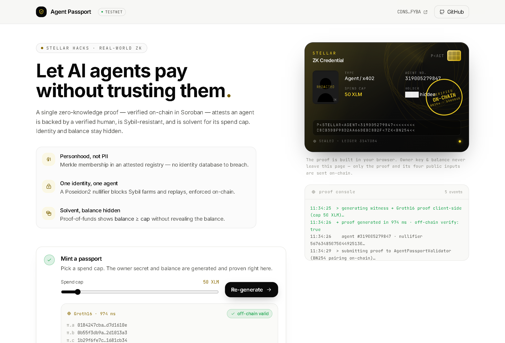

# 🛂 open-stellar-passport

**A zero-knowledge "passport" that lets autonomous AI agents pay — without doxxing their owner or exposing their balance.**

Built for the [Stellar Hacks: Real-World ZK](https://dorahacks.io/hackathon/stellar-hacks-zk) hackathon. The trust layer that [Open-Stellar](https://github.com/leocagli/Open-Stellar) (and any agent-commerce hub on Stellar) was missing.



> Live demo: real in-browser Groth16 proving → real on-chain verification → x402 payment gate. Run it with `cd frontend && npm install && npm run dev`.

🎬 **Demo video** (1:40, captioned screencast of the live flow): [narrated](docs/demo-narrated.mp4) · [silent](docs/demo.mp4) — script & shot list in [docs/VIDEO.md](docs/VIDEO.md), Remotion project in [video/](video/)

---

## The problem (it bleeds money *and* identity today)

AI agents are starting to pay for things autonomously (x402). To let an agent transact, today you do one of two dangerous things:

1. **Hand it keys or your full balance** → if the agent is compromised, you lose everything (money loss).
2. **KYC the operator into a central database** → another honeypot that gets breached (identity loss — see the 2025 exchange KYC leaks).

And agents get **impersonated and Sybil-farmed**. There's no way to know an agent is backed by a real, solvent, authorized human *without* revealing who they are or how much they hold.

Every existing "agent passport" (SelfClaw, risotto-passport, World ID + AgentKit…) lives on EVM/Solana, verifies identity **off-chain** via an external service, only proves personhood **once**, and **never gates the actual payment with proof-of-funds**. None are on Stellar.

## The solution

The human owner mints an **Agent Passport**: a ZK credential bound to the agent's Stellar address that proves, in a single Groth16 proof verified **on-chain in Soroban**:

| Claim | How |
|---|---|
| 🧍 The operator is a verified human/business | Merkle membership in an attested-identity registry (no PII on-chain) |
| 🔒 One identity can't spawn infinite agents | Poseidon2 **nullifier** bound to the agent id (anti-Sybil / anti-replay) |
| 💰 The operator is solvent for the spend | **proof-of-funds**: `balance ≥ spendCap`, balance stays hidden |

A compromised agent can't exceed its proven cap. The owner's identity and real balance never leave the device. An auditor can later be given a view key (selective disclosure — roadmap).

## How it plugs into Stellar

```
Human → mints agent in trionlabs/stellar-8004 Identity Registry (agent_id)
      → owner generates Groth16 proof CLIENT-SIDE (snarkjs/WASM, secrets never leave)
      → AgentPassportValidator (Soroban) verifies proof on BN254
      → writes a "zk-passport" attestation into the 8004 Validation Registry
At payment time (x402): settle only if agent has a valid passport AND amount ≤ proven cap.
```

We reuse:
- **[NethermindEth/stellar-private-payments](https://github.com/NethermindEth/stellar-private-payments)** (Apache-2.0) — the `circom-groth16-verifier` Soroban contract (BN254 native precompile) and the Poseidon2 / Keypair / MerkleProof circom building blocks.
- **[trionlabs/stellar-8004](https://github.com/trionlabs/stellar-8004)** (MIT) — ERC-8004 Identity / Reputation / Validation registries on Soroban.

## The circuit ([`circuits/agent_passport.circom`](circuits/agent_passport.circom))

```
private: privateKey, balance, pathElements[20], pathIndices
public : registryRoot, nullifierHash, agentId, spendCap
proves : publicKey = Poseidon2(privateKey, 0)
         MerkleProof(publicKey, path) == registryRoot      // personhood
         nullifierHash == Poseidon2(privateKey, agentId)   // anti-Sybil/replay
         balance >= spendCap                                // proof-of-funds
```
~9.6k constraints · 4 public inputs · proves in well under a second client-side.

## Status

- [x] **Phase 0** — circuit compiles, Groth16 trusted setup, **proof generated & verified off-chain** ✅
- [x] **Phase 1** — VK baked into the Soroban `circom-groth16-verifier`, **deployed to testnet & proof verified ON-CHAIN** ✅
  - Verifier contract: [`CCMKLYSRUH2HMA4UU6WLXWQXEY6KAH5AWB5BEVMJGNGC5GLGTVROLG4A`](https://stellar.expert/explorer/testnet/contract/CCMKLYSRUH2HMA4UU6WLXWQXEY6KAH5AWB5BEVMJGNGC5GLGTVROLG4A) (testnet)
  - Valid proof → `true`; tampered public input → `InvalidProof` (soundness verified)
- [x] **Phase 2** — [`AgentPassportValidator`](contracts/agent-passport-validator/) (stateful policy layer) + TypeScript SDK ✅
  - Validator contract: [`CDNSZUNEWFCGSPWLPDSWTENR2WPHKC34RGZQG7RJA54OPGTZGVVRFYBA`](https://stellar.expert/explorer/testnet/contract/CDNSZUNEWFCGSPWLPDSWTENR2WPHKC34RGZQG7RJA54OPGTZGVVRFYBA) (testnet)
  - Cross-contract calls the verifier, **burns the nullifier (anti-replay / anti-Sybil)**, mints a `zk-passport` attestation
  - On-chain e2e: `verify_and_register` → minted ✅; **replay → `NullifierUsed` ✅**; tampered input → `InvalidProof` ✅ (5 unit tests run the real proof through the real verifier WASM)
  - [`@open-stellar/agent-passport`](sdk/) SDK: client-side proving (snarkjs) + typed client + the `authorizePayment` x402 gate
- [x] **Phase 3** — live [demo frontend](frontend/) ✅
  - Real in-browser Groth16 proving (~1 s) → **real on-chain verification** (no wallet needed) → x402 payment gate → anti-replay
  - Vite + React 19 + Tailwind v4; design system in [`design-system/`](design-system/) (published to Claude Design)
  - Run: `cd frontend && npm install && npm run dev`
- [ ] Selective-disclosure view key + per-payment `amount ≤ cap` proof (stretch)

## Build (Phase 0)

```bash
# prerequisites: node, circom 2.2.x, snarkjs
npm install
# compile circuit
circom circuits/agent_passport.circom --r1cs --wasm --sym -o build
# trusted setup (downloads powers-of-tau 2^14)
npx snarkjs groth16 setup build/agent_passport.r1cs build/pot14_final.ptau build/agent_passport_0000.zkey
npx snarkjs zkey contribute build/agent_passport_0000.zkey build/agent_passport_final.zkey -e="<entropy>"
npx snarkjs zkey export verificationkey build/agent_passport_final.zkey build/verification_key.json
# end-to-end smoke test: generate + verify a proof
node scripts/smoke.mjs   # ==> PROOF VALID: true
```

## License

MIT. Vendored circuit building blocks under `circuits/lib/` are Apache-2.0 (© Nethermind), derived from tornadocash/tornado-nova.

> ⚠️ Research prototype for a hackathon. Not audited. Do not use with real funds.
